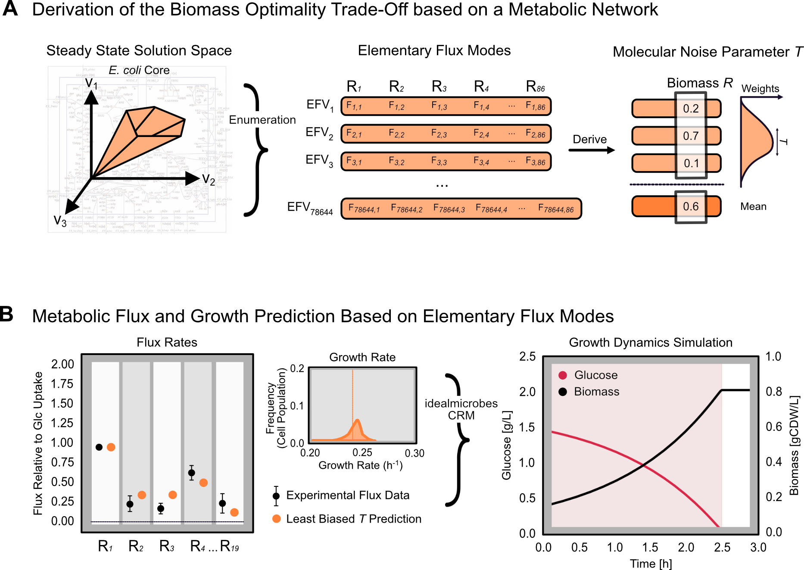

# ⚡️ From Metabolic Networks to Ecology: A Hybrid Framework for Modelling Microbial Growth

<p align="center">
  
</p>

This project integrates a hybrid framework that bridges constraint-based metabolic models (FBA) 
and consumer–resource models using elementary flux vectors (EFVs). With *E. coli* as a case study, 
we show how EFVs informed by molecular noise improve predictions of flux distributions, growth, 
and nutrient dynamics.

This repository contains the code, data, and environment configuration for this project.

## 🗂️ Repository Structure

```
├── code/ # Core scripts for analyses and simulations
│ ├── GEM_Reduction/ # Scripts for GEM reduction strategies
│ ├── Ideal_Microbes_Benchmarking/ # Benchmarking Ideal Microbes framework
│ ├── Ideal_Microbes_Simulations/ # Simulations with Ideal Microbes package
│ ├── Mplrs_Analysis/ # Analysis of mode enumeration with mplrs
│ └── Optimal_Flux_Vectors/ # Scripts for OFV preparation and analysis
│
├── data/
│ ├── processed/ # Processed/derived datasets
│ └── raw/ # Raw input data
│
├── src/ # Source utilities and helper functions
│ └── utils.py # Common utility functions
│
├── .gitignore # Ignore rules for git
├── environment.yml # Conda environment for reproducibility
└── README.md # Project overview (this file)
```

## ⚙️ Setup & Installation

To reproduce the analyses and run the code in this repository, we recommend using [conda](https://docs.conda.io/).

### 1. Clone the repository
```bash
git clone https://github.com/LucaKristinas/msc-thesis-metabolism-to-ecology.git
cd /msc-thesis-metabolism-to-ecology
```

### 2. Create the environment
```bash
conda env create -f environment.yml
```

### 3. Activate the environment
```bash
conda activate met_to_eco_env
```

## ▶️ Running Analyses

Once the environment is active, analyses can be reproduced by running the scripts inside the `code/` directory. Each subfolder contains scripts for a different part of the project:
 
- **`code/Ideal_Microbes_Benchmarking/`** → benchmarking the *Ideal Microbes* framework.  
- **`code/Ideal_Microbes_Simulations/`** → simulations using the *Ideal Microbes* package.  
  > **Note:** These analyses can only be run once the package associated with the manuscript  
  *“Metabolic Ecology of Microbes: From Metabolic Networks to Growth Laws and Population Dynamics”* (V. Piskovsky, L. Schnepp-Pesch, and K. Foster; status as of September 2025: in preparation for submission) is publicly available.  
- **`code/Mplrs_Analysis/`** → mode enumeration with `mplrs` and scalability analysis.  
- **`code/GEM_Reduction/`** → idea(s) for genome-scale metabolic model (GEM) reduction. 


## 🛠️ Dependencies

This project makes use of the following external tools:

- **[EFMlrs](https://github.com/BeeAnka/EFMlrs)**: Buchner, Bianca A., and Jürgen Zanghellini. "EFMlrs: a Python package for elementary flux mode enumeration via lexicographic reverse search." BMC bioinformatics 22.1 (2021): 547.
- **[mplrs](https://cgm.cs.mcgill.ca/~avis/C/lrs.html)**: Avis, David, and Charles Jordan. "mplrs: A scalable parallel vertex/facet enumeration code." Mathematical Programming Computation 10.2 (2018): 267-302.
- **[COBRApy](https://github.com/opencobra/cobrapy)**: Ebrahim, Ali, et al. "COBRApy: constraints-based reconstruction and analysis for python." BMC systems biology 7.1 (2013): 74.
- **[Memote](https://github.com/opencobra/memote)**: Lieven, Christian, et al. "MEMOTE for standardized genome-scale metabolic model testing." Nature biotechnology 38.3 (2020): 272-276.

## 📄 License

This repository is licensed under the [MIT License](./LICENSE) © 2025 LucaKristinas.  
You are free to use, modify, and distribute this work, provided proper attribution is given.